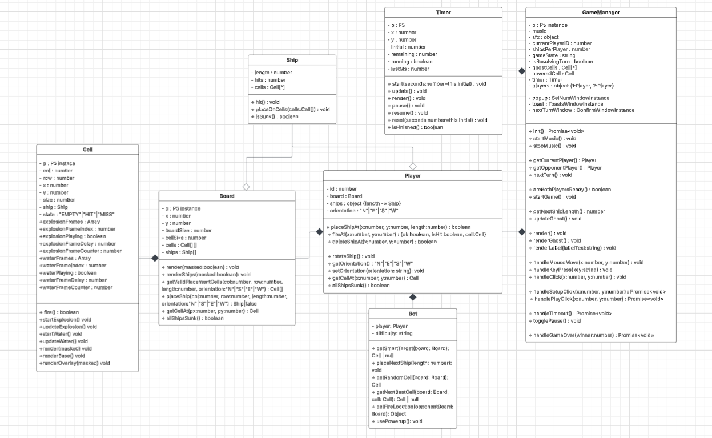
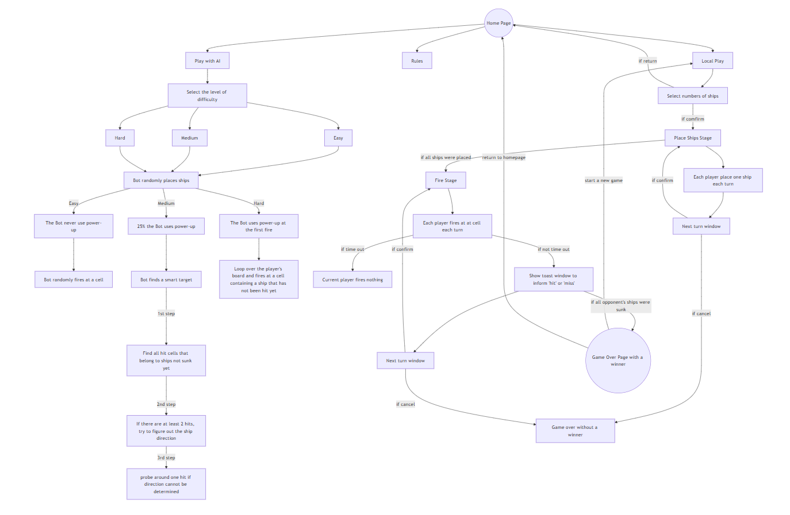

# Battleship
This is project 1 for CSC 710: Software Engineering

## Rules

- Select number of ships (1-5) for each player.
- Each player take turns to place one ship on their board. Press "R" to rotate. Press "X" to delete.
- Players take turns choosing a cell to fire. Press "SPACE" to pause the turn.
- A hit damages a ship; a miss does nothing.
- A ship is sunk when all its cells are hit.
- The first player to sink all enemy ships wins.

## UI design
https://drive.google.com/file/d/13FF2wbfPfjfe8J7fAAxuiQVennsSb_kH/view?usp=sharing

## API Documentation

by JSDoc:

  

This project follows an object-oriented design approach to ensure better maintainability and scalability.

## Third-Party Libraries

- **p5.js** — used to render the game canvas (boards, cells, ships, etc.).

  Source: https://github.com/processing/p5.js

- **Bootstrap** — used for styling UI components such as the toast window plugin and confirmation window plugin.
  Source: https://github.com/twbs/bootstrap

## UML Diagram

https://lucid.app/lucidchart/15ec66e2-a129-47a5-b60f-0e5c46ef4457/edit?viewport_loc=-3417%2C-262%2C3959%2C1978%2C0_0&invitationId=inv_f99fdabf-dc79-4185-9498-d33d60b306c1

  

## Program Flow Control Diagram

https://battleshipflowcontrol.netlify.app/

  

