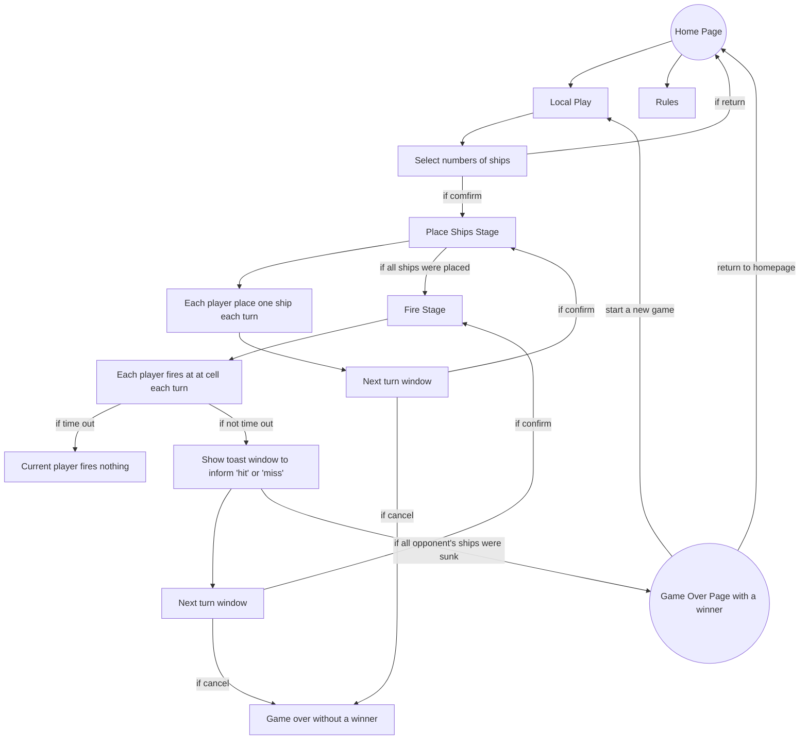

```mermaid
graph TD
start((Home Page)) --> localPlay[Local Play]
start((Home Page)) --> rules[Rules]
localPlay --> numSel[Select numbers of ships]
numSel -- if return --> start
numSel -- if comfirm --> placeShips[Place Ships Stage]
placeShips --> playerPlaceShips[Each player place one ship each turn] --> nextTurnWindow[Next turn window]
nextTurnWindow -- if confirm --> placeShips
nextTurnWindow -- if cancel --> gameOverNoWinner[Game over without a winner]
placeShips -- if all ships were placed --> fireStage[Fire Stage]
fireStage --> playerFires[Each player fires at at cell each turn]
playerFires -- if time out --> firesNothing[Current player fires nothing]
playerFires -- if not time out --> toastWindow["Show toast window to inform 'hit' or 'miss'"]
toastWindow --> nextTurnWindowAtFire[Next turn window]
nextTurnWindowAtFire -- if cancel --> gameOverNoWinner
nextTurnWindowAtFire -- if confirm --> fireStage
toastWindow -- if all opponent's ships were sunk --> terminate((Game Over Page with a winner))
terminate -- start a new game --> localPlay
terminate -- return to homepage --> start
```
