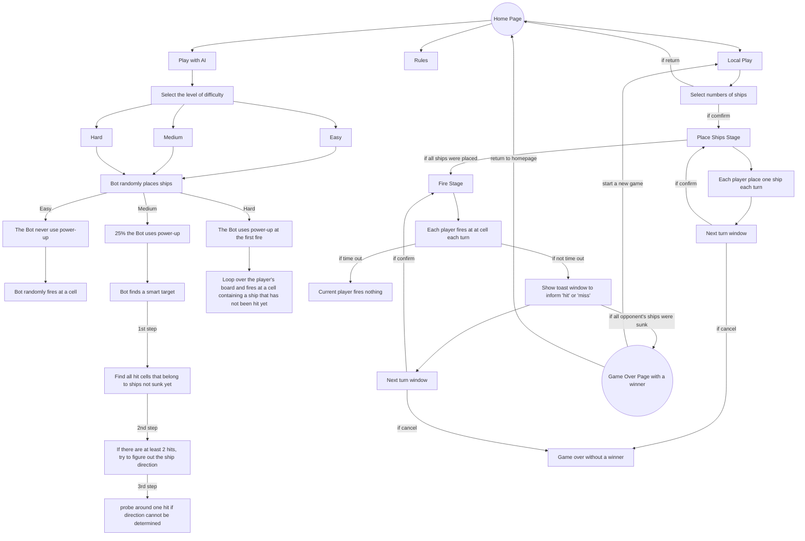

```mermaid
graph TD
start((Home Page)) --> localPlay[Local Play]
start((Home Page)) --> rules[Rules]
start --> playWithAI[Play with AI]
playWithAI --> selDifficulty[Select the level of difficulty]
selDifficulty --> esay[Easy]
selDifficulty --> medium[Medium]
selDifficulty --> hard[Hard]
esay --> randomPlace[Bot randomly places ships]
medium --> randomPlace
hard --> randomPlace
randomPlace -- Easy --> esayPowerup[The Bot never use power-up] --> randomFires[Bot randomly fires at a cell]
randomPlace -- Medium --> mediumPowerup[25% the Bot uses power-up] --> smartTarget[Bot finds a smart target]
smartTarget -- 1st step --> allHitCells[Find all hit cells that belong to ships not sunk yet]
allHitCells -- 2nd step --> figureShipDirection[If there are at least 2 hits, try to figure out the ship direction]
figureShipDirection -- 3rd step --> getNextBestCell[probe around one hit if direction cannot be determined]
randomPlace -- Hard --> hardPowerup[The Bot uses power-up at the first fire] --> botCheat[Loop over the player's board and fires at a cell containing a ship that has not been hit yet]
localPlay --> numSel[Select numbers of ships]
numSel -- if return --> start
numSel -- if comfirm --> placeShips[Place Ships Stage]
placeShips --> playerPlaceShips[Each player place one ship each turn] --> nextTurnWindow[Next turn window]
nextTurnWindow -- if confirm --> placeShips
nextTurnWindow -- if cancel --> gameOverNoWinner[Game over without a winner]
placeShips -- if all ships were placed --> fireStage[Fire Stage]
fireStage --> playerFires[Each player fires at at cell each turn]
playerFires -- if time out --> firesNothing[Current player fires nothing]
playerFires -- if not time out --> toastWindow["Show toast window to inform 'hit' or 'miss'"]
toastWindow --> nextTurnWindowAtFire[Next turn window]
nextTurnWindowAtFire -- if cancel --> gameOverNoWinner
nextTurnWindowAtFire -- if confirm --> fireStage
toastWindow -- if all opponent's ships were sunk --> terminate((Game Over Page with a winner))
terminate -- start a new game --> localPlay
terminate -- return to homepage --> start
```
